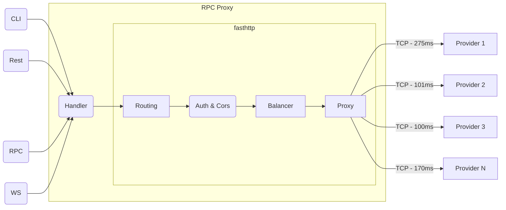

# RPC Aggregator

Welcome to rpc.ag, the rpc aggregator tool for DApps! It simplifies node provider integration
by balancing requests across multiple providers through a single endpoint. rpc.ag also enhances observability, improving
the overall management and efficiency of your DApp infrastructure. Empower the community with better control and
observability by using rpc.ag as the homepage of DApp blockchain infrastructure. Big brothers started watching node
providers.

## Architecture
The architecture of the RPC aggregator with load balancing is shown in the following flowchart:

if you are curious about details

## Short-Term TODO

- [x] Implement rate limiting
- [x] Implement CORS Policy and api keys
- [ ] Implement a ping metric fetcher from all providers
- [ ] Implement a healthcheck scheduler to add the provider(node) back when they are functioning properly
- [ ] Detect when a node is behind, remove it and watch closely again
- [ ] Implement prometheus metrics & endpoint
- [ ] Implement an API lists all nodes (except their API keys) their performance and a simple uptime

## Roadmap

### Phase 0: Release v0 ⌛️

- [ ] Distribute api keys for every project attends to [grizzlython](https://solana.com/grizzlython) with ability of;
- [x] Api key auth & CORS
- [x] Rate limiting

### Phase 1: Public Page

- [ ] Build a public page on [rpc.ag](rpc.ag) that showcases the RPC Aggregator and its features.
- [ ] Include information on how to use the RPC Aggregator.
- [ ] Build an uptime page for transparency and accountability.
- [ ] Show fastest & most available node providers with uptime history
- [ ] Show average ping time with ability of filtering by provider and region 

### Phase 2: Prometheus Exporter and Grafana Dashboards

- Build a Prometheus exporter that exposes the collected metrics in a format that can be scraped by Prometheus.
- Create a set of Grafana dashboards that visualize the performance metrics for the RPC Aggregator and its providers.

### Phase 3: Uptime Page

- Develop an uptime page that displays the current status of the RPC Aggregator and the providers.
- Integrate the monitoring system with the uptime page to display real-time health and performance metrics.
- Allow users to subscribe alerts for downtime or performance issues.

### Phase 4: Become the home page of blockchain infrastructure

- Yes.

With this roadmap, we aim to add a robust monitoring and performance tracking system to the RPC Aggregator, along with a
Prometheus exporter, Grafana dashboards, an uptime page, and a public page. These features will provide greater
visibility into the health and performance of the RPC Aggregator and its providers, and promote transparency and
accountability for blockchain world.

## Developers

rpc.ag provides free rpc endpoints for developers and for projects at their super early stage. Please reach us at
info@rpc.ag

## Providers

If you are a node provider and want to support developer community and want to be mentioned here, reach us at
info@rpc.ag

## Contributing

If you would like to contribute to the RPC Aggregator with load balancing, please fork the repository and create a pull
request with your changes. Be sure to include unit tests and adhere to the project's coding style.

> IF, the project get support (grant from any blockchain) to cover some server expenses and a bit more, we will share it
> to developers who contribute to rpc.ag at any level (proxy, doc, monitoring, etc) we will also open some grants for
> huge tasks and/or issues

Total grant so far: $0  
Sol Wallet to support, donate & track `rpcroe9QQug5tfnG5hvZRCv65R27n3JdFpWuxhBkekH`

