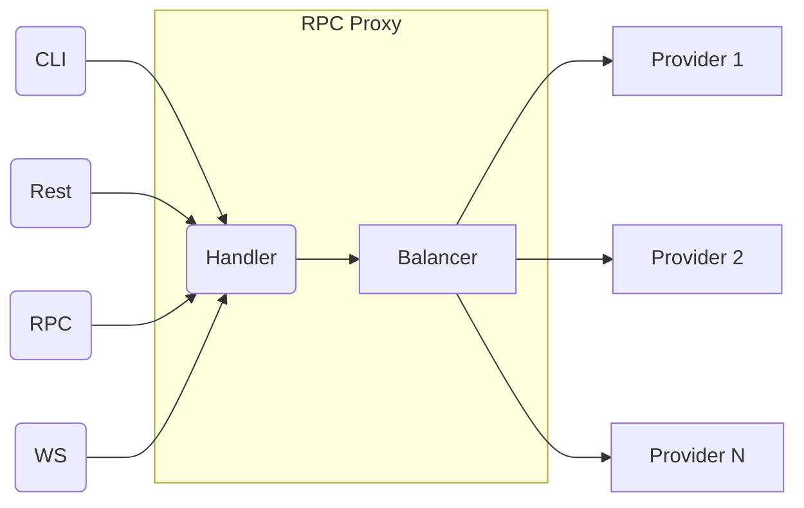

# RPC Proxy

This is an implementation of an RPC proxy with load balancing in Golang. The proxy is responsible for handling incoming
requests and distributing them to multiple providers for processing.

## Architecture

The architecture of the RPC proxy with load balancing is shown in the following flowchart:

## Usage

Once the proxy is running, requests can be sent to it through the CLI, REST, RPC, or WebSocket interfaces. Responses
will be returned by one of the Provider modules in the load balancing pool.

## Contributing

If you would like to contribute to the RPC proxy with load balancing, please fork the repository and create a pull
request with your changes. Be sure to include unit tests and adhere to the project's coding style.

