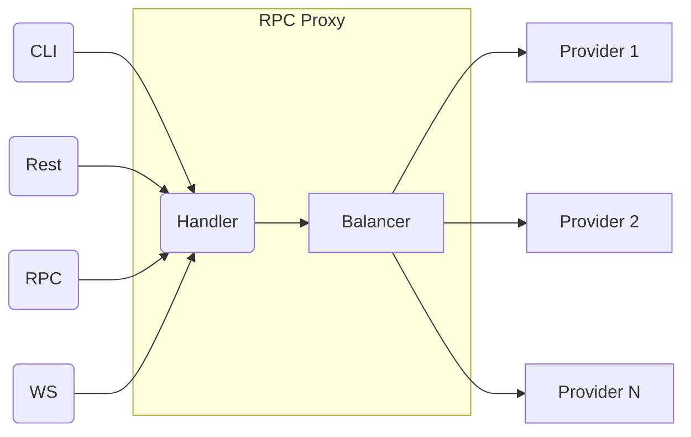

# RPC Proxy

This is an implementation of an RPC proxy with load balancing in Golang. The proxy is responsible for handling incoming
requests and distributing them to multiple Node providers for processing.

## Architecture

The architecture of the RPC proxy with load balancing is shown in the following flowchart:

## Roadmap
### Phase 1: Prometheus Exporter and Grafana Dashboards
- Build a Prometheus exporter that exposes the collected metrics in a format that can be scraped by Prometheus.
- Create a set of Grafana dashboards that visualize the performance metrics for the RPC proxy and its providers.

### Phase 2: Uptime Page
- Develop an uptime page that displays the current status of the RPC proxy and the providers.
- Integrate the monitoring system with the uptime page to display real-time health and performance metrics.
- Allow users to subscribe to alerts for downtime or performance issues.

### Phase 3: Public Page
- Build a public page on [rpc.ag](rpc.ag) that showcases the RPC proxy and its features.
- Include information on how to use the RPC proxy.
- Build an uptime page and Grafana dashboards for transparency and accountability.
- Show fastest & most available node providers

With this roadmap, we aim to add a robust monitoring and performance tracking system to the RPC proxy, along with a
Prometheus exporter, Grafana dashboards, an uptime page, and a public page. These features will provide greater
visibility into the health and performance of the RPC proxy and its providers, and promote transparency and
accountability for blockchain world.

## Contributing

If you would like to contribute to the RPC proxy with load balancing, please fork the repository and create a pull
request with your changes. Be sure to include unit tests and adhere to the project's coding style.

